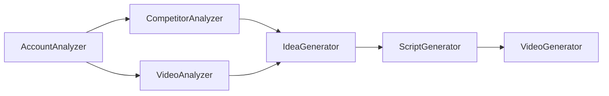

## **1.**

## **Restate Your Assets & Current State**

### **What You Have Right Now:**

- **Mobile app (Expo):** User-facing, for a wide audience (MVP soon ready)
- **Server for app (Node/JS or Python):** Handles user data, orchestrates some features
- **Separate Python POCs:**
    - Video Analyzer (virality prediction, etc)
    - Account Analyzer (scraping, stats, reporting)
    - Competitor Analyzer (planned or basic version)
- **Editorial Profile, Voice Cloning, Video Generation features (partially integrated or ready to integrate)**
- **Some infra for automating or API-calling Creatomate/ElevenLabs/etc**

### **Business/Delivery Goals:**

- **Mobile app = product for a broader audience** (SaaS/consumer, low-touch)
- **Upwork/Gig modules = targeted offers for specific, actionable results** (higher-touch, custom or semi-custom)
- **You want to keep iterating, quickly test ideas/Pocs, but also ship and sell real value soon**

---

## **2.**

## **System Design: Productized Building Blocks & Strategic Flows**

Here’s how you can conceptualize and *sequence* your builds to maximize both short-term delivery and long-term coherence.

---

### **A. Think in Terms of Productized “Building Blocks”**

**Every “block” or module should meet one or more of these:**

- **Can be used standalone** (even if later it’s “just” a microservice or background module)
- **Can be showcased/demo’d (Upwork project, demo video, live on app)**
- **Can be integrated with others to form a pipeline (“full stack”)**
- **Delivers a clear, visible result for the user or client** (not just infrastructure)

---

### **B. Map Typical User Flows for Both App & Client Service**

### **Flow 1: Content Creator Mobile App (End User)**

1. **Connect your account (TikTok/Instagram)**
2. **Account Analyzer:** Scrape your account, see analytics & weak points
3. **Video Analyzer:** Analyze past videos, get virality/prediction/feedback
4. **Competitor Analyzer:** See what competitors do, what works in your niche
5. **Idea Generator:** Suggestions for your next post (using all previous data)
6. **Script Generator:** Write the video script for you, in your style
7. **Video Generator:** Auto-generate the video (optionally with voice)
8. **Auto-Publish:** (future) Push to TikTok directly

### **MVP Focus for Mobile App:**

- Steps 2, 3, and 5.
- Optional (stretch): Step 4 (Competitor), Step 6 (Script).

---

### **Flow 2: Upwork/Freelance Client Project**

A client comes with a **problem**, you offer a **microservice** or “mini-app”:

- “Audit my account for performance & give me an actionable report” (Account Analyzer + Insights)
- “Predict why my last 10 videos didn’t go viral” (Video Analyzer)
- “Do competitor analysis and give me a top-5 list + content gap report” (Competitor Analyzer)
- “Generate 10 video ideas and 3 sample scripts for my TikTok” (Idea + Script Generator)
- “Build me a pipeline to generate and publish AI videos weekly” (Custom, bigger gig)

### **MVP Focus for Upwork:**

- Step 2 (Account Analyzer)
- Step 3 (Video Analyzer)
- Step 4 (Competitor Analyzer)
- Step 5 (Idea Generator)
- Each one = a *sellable, outcome-driven gig*
- Full pipeline = “premium offer” or “custom bundle”

---

## **3.**

## **What to Prioritize?**

### **SHORT TERM (1-2 WEEKS):**

**What is easiest to demo, sell, and delivers an instant result?**

- **Account Analyzer**:
    - Scrape account, output a beautiful report (PDF, web, app view)
    - List “actionable insights” (“here’s why your account isn’t growing”, “post at X time”, etc)
    - **Can be run stand-alone, no need for full automation**
- **Video Analyzer (Virality POC)**:
    - User uploads video(s), gets: “Your video scored X on the virality scale, because Y”
    - **Insights**: “Improve X, Y, Z to increase virality”
    - *Optional*: Connect it to the Account Analyzer for even better recommendations
- **Competitor Analyzer (Minimum Viable Version):**
    - Input: hashtag or account
    - Output: Top competitors, best performing content, content gaps

**Each of these can be offered as a single Upwork project/service, demoed live, and integrated into your app as you go.**

---

### **MID TERM (3-6 WEEKS):**

- **Idea Generator** (connects to Account + Competitor)
- **Script Generator** (using user profile for tone)
- **Simple Video Generator** (pipeline using Creatomate or ElevenLabs; later, more advanced)

---

### **LONG TERM:**

- Full *integrated* app (app + backend + orchestrated modules)
- Auto-publishing, real-time trend tracking, LLM-powered agent, etc.

---

## **4.**

## **Productizing: Mobile App vs. Upwork Services**

### **Mobile App:**

- **Simple, actionable results** (“Find out why your last 10 TikToks didn’t pop”)
- **Action: Connect account, analyze, see report, get tips**
- **Upsell: Want script ideas? Want a ready-made video? Want a competitor analysis?**
- This keeps it *plug-and-play* for a broad audience.

### **Upwork:**

- **Outcome-based microservices**
    - “Account Audit” (Account Analyzer)
    - “Video Audit” (Virality POC)
    - “Competitor Gap Analysis” (Competitor Analyzer)
    - “Content Ideas & Scripts” (Idea/Script Generator)
- **Custom pipeline/project**
    - “Build my AI-powered content system” (bundle offer)

**Each project is based on the same core code, you just package/deliver it differently.**

---

## **5.**

## **How to Organize Your Builds?**

1. **Prioritize Account Analyzer → Video Analyzer → Competitor Analyzer**
    - All 3 can be run independently, demoed, and sold.
    - Each makes the next one stronger via data feedback loops.
2. **Deliver Minimum Viable Version of Each (even CLI or notebook at first)**
    - App: Integrate as feature tabs/pages
    - Upwork: Polish as “client-ready” (PDF reports, clean UI, clear deliverables)
3. **Don’t Wait for Perfect Integration**
    - You can connect them later; ship each block as soon as it stands on its own.

---

## **6.**

## **Agile, Lean, and Fast: Your Immediate Next Steps**

- **Choose which one is closest to “ready” (likely Account Analyzer)**
- **Polish UX and reporting for one end-user flow (app & gig)**
- **Launch/test/sell it**
- **Quickly iterate on the next (Video Analyzer, etc)**
- **Integrate features as feedback and traction warrant**

---

## **Summary Table**

| **Feature** | **Mobile App MVP?** | **Upwork Project?** | **Dev Effort** | **Sales Potential** | **Next Step?** |
| --- | --- | --- | --- | --- | --- |
| Account Analyzer | ✅ | ✅ | LOW | HIGH | Finish & Polish |
| Video Analyzer | ✅ | ✅ | MEDIUM | HIGH | Polish POC |
| Competitor Analyzer | Optional MVP | ✅ | MEDIUM | MEDIUM | MVP Version |
| Idea Generator | Nice-to-have | ✅ | MEDIUM | MEDIUM | Later |
| Script Generator | Nice-to-have | ✅ | HIGH | MEDIUM | Later |
| Video Generator | Future | ✅ | HIGH | HIGH | Future |

---

## **Diagram (Simplified for Action)**

- **But:** Each node can *stand alone* and be sold/demo’d as a product/service.

---

### **TL;DR:**

**Deliver the Account Analyzer as a usable product—first in your mobile app, then as a standalone Upwork gig.**

**Polish the Video Analyzer next, then Competitor Analysis.**

**Iterate quickly, package each as a demo and microservice, then combine them as you go.**

---