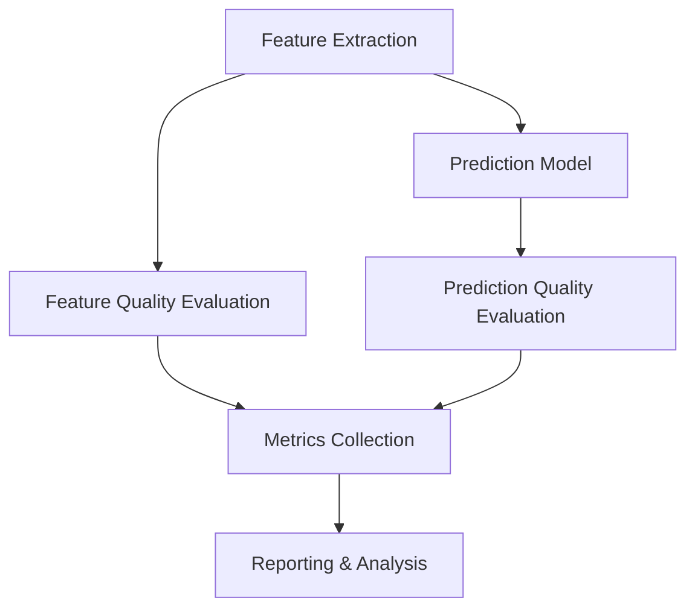

# Evaluation Framework

## Overview

This document outlines our evaluation framework for the TikTok virality prediction system, following the 80/20 principle to focus on high-impact metrics while maintaining a pragmatic approach.

## Table of Contents

1. [Architecture](#architecture)
2. [Data Organization](#data-organization)
3. [Metrics & KPIs](#metrics--kpis)
4. [Implementation](#implementation)
5. [Workflow](#workflow)

## Architecture

### Component Overview



### Technology Stack

- **Feature Extraction**: Gemini API
- **Data Processing**: Python, Pandas, NumPy
- **Metrics Storage**: JSON/Parquet files
- **Visualization**: Streamlit, Plotly
- **Reporting**: Automated Markdown/PDF generation

## Data Organization

```
project_root/
├── data/
│   └── evaluation/          # Evaluation data
│       ├── metrics/         # Performance metrics
│       ├── golden_set/      # Curated test data
│       └── benchmarks/      # Benchmark results
├── reports/
│   └── evaluation/         # Generated reports
└── config/
    └── evaluation/         # Evaluation configs
```

### Data Formats

#### Metrics Schema

```json
{
  "evaluation_id": "eval_20240315_001",
  "timestamp": "2024-03-15T10:00:00Z",
  "feature_metrics": {
    "visual_analysis": {
      "completeness": 0.95,
      "accuracy": 0.88
    },
    "audio_analysis": {
      "completeness": 0.92,
      "accuracy": 0.85
    }
  },
  "prediction_metrics": {
    "accuracy": 0.85,
    "calibration": 0.9,
    "timeliness": 0.95
  }
}
```

#### Golden Set Schema

```json
{
  "video_id": "vid_001",
  "metadata": {
    "url": "https://...",
    "creation_date": "2024-03-15",
    "category": "dance"
  },
  "ground_truth": {
    "virality_score": 0.95,
    "engagement": {
      "views": 1000000,
      "likes": 100000,
      "shares": 50000
    }
  }
}
```

## Metrics & KPIs

### Feature Extraction Quality

| Metric       | Description                      | Target |
| ------------ | -------------------------------- | ------ |
| Completeness | % of expected features extracted | >95%   |
| Accuracy     | Quality vs ground truth          | >90%   |
| Consistency  | Stability across similar videos  | >85%   |

### Prediction Quality

| Metric      | Description                      | Target |
| ----------- | -------------------------------- | ------ |
| Accuracy    | Prediction vs actual virality    | >80%   |
| Calibration | Reliability of confidence scores | >85%   |
| Timeliness  | Early prediction capability      | <2hrs  |

### System Performance

| Metric         | Description               | Target |
| -------------- | ------------------------- | ------ |
| Latency        | Processing time per video | <3min  |
| Resource Usage | CPU/Memory efficiency     | <70%   |
| Error Rate     | Failed analysis rate      | <5%    |

## Implementation

### Feature Extraction Evaluation

```python
from src.evaluation.feature_quality import FeatureQualityEvaluator

evaluator = FeatureQualityEvaluator(
    config_path="config/evaluation/feature_extractors.yaml"
)

# Evaluate a batch of videos
results = evaluator.evaluate_batch(video_batch)
```

### Prediction Quality Evaluation

```python
from src.evaluation.prediction_quality import PredictionQualityEvaluator

evaluator = PredictionQualityEvaluator(
    model_path="models/current",
    metrics_config="config/evaluation/metrics.yaml"
)

# Evaluate predictions
results = evaluator.evaluate_predictions(predictions, ground_truth)
```

## Workflow

### 1. Daily Evaluation

- Run feature extraction evaluation on new videos
- Update prediction quality metrics
- Generate daily report
- Alert if metrics fall below thresholds

### 2. Weekly Analysis

- Trend analysis of all metrics
- Performance review meeting
- Update golden dataset if needed
- Adjust thresholds if necessary

### 3. Monthly Review

- Comprehensive performance analysis
- Strategy adjustment if needed
- Dataset cleanup and maintenance
- Documentation updates

## Best Practices

1. **Data Management**

   - Regular backup of evaluation data
   - Version control of configurations
   - Clear documentation of changes

2. **Quality Assurance**

   - Regular validation of golden dataset
   - Cross-validation of metrics
   - Peer review of significant changes

3. **Monitoring**
   - Real-time metric tracking
   - Automated alerts for anomalies
   - Regular performance reviews

## Future Improvements

1. **Short Term**

   - Implement automated daily reports
   - Add more granular feature metrics
   - Improve error tracking

2. **Medium Term**

   - Add A/B testing framework
   - Implement continuous evaluation
   - Enhance visualization dashboard

3. **Long Term**
   - ML-based metric analysis
   - Automated optimization
   - Advanced anomaly detection
