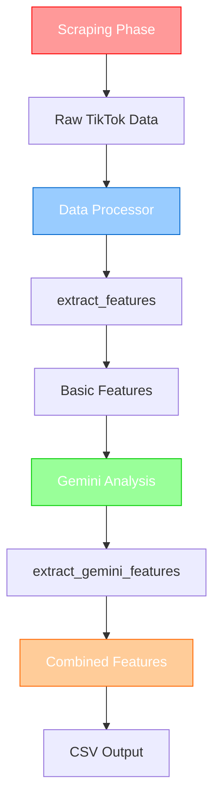
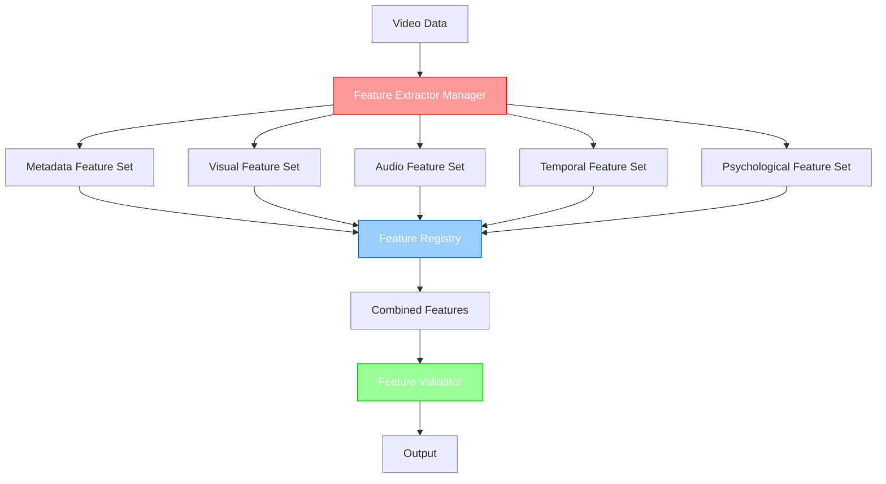

# 🏗️ Analyse Architecturale et Stratégie de Refactorisation

## 🔍 **État Actuel de l'Architecture**

### **Flux de Données Actuel**



### **Composants Identifiés**

#### **1. Data Processor (Responsable Principal)**
- **Localisation** : `src/features/data_processor.py`
- **Responsabilités** :
  - `extract_features()` : Features métadonnées (15 features)
  - `extract_gemini_features()` : Features Gemini (15 features)
  - `process_video()` : Orchestration des extractions
  - `process_dataset()` : Traitement batch

#### **2. Pipeline Orchestrator**
- **Localisation** : `scripts/run_pipeline.py`
- **Responsabilités** :
  - Orchestration des phases (scraping → Gemini → features)
  - Gestion des erreurs et retry
  - Tracking des progrès

#### **3. Data Validator**
- **Localisation** : `src/utils/data_validator.py`
- **Responsabilités** :
  - Validation des données d'entrée
  - Filtrage des vidéos corrompues
  - Pas d'extraction de features

---

## 🎯 **Problèmes Identifiés**

### **1. Couplage Fort**
- **Data Processor** contient TOUTES les logiques d'extraction
- Impossible de changer de feature set sans modifier le code
- Pas de séparation entre métadonnées et analyse Gemini

### **2. Manque de Modularité**
- Pas de système de "feature sets" configurables
- Difficile d'expérimenter avec différents jeux de features
- Pas de possibilité d'activer/désactiver des features

### **3. Documentation Manquante**
- README fait référence à des documents inexistants
- Pas de documentation du flux de données
- Pas de guide d'architecture

### **4. Flexibilité Limitée**
- Impossible de "jongler" avec les features
- Pas de système d'expérimentation
- Architecture monolithique

---

## 🚀 **Stratégies Possibles**

### **Option 1 : Entraîner Maintenant (Quick Win)**
```python
# Utiliser l'architecture actuelle
# Avantages : Rapide, pas de refactorisation
# Inconvénients : Pas de flexibilité future
```

### **Option 2 : Ajouter Features Visuelles (Incremental)**
```python
# Ajouter quelques features visuelles au Data Processor
# Avantages : Amélioration immédiate
# Inconvénients : Couplage encore plus fort
```

### **Option 3 : Refactorisation Modulaire (Recommandée)**
```python
# Architecture modulaire avec feature sets
# Avantages : Flexibilité maximale, évolutivité
# Inconvénients : Effort initial plus important
```

---

## 🏗️ **Architecture Modulaire Proposée**

### **Nouvelle Architecture**



### **Composants Proposés**

#### **1. Feature Extractor Manager**
```python
class FeatureExtractorManager:
    """Gestionnaire central des feature extractors."""
    
    def __init__(self, feature_sets: List[str]):
        self.feature_sets = feature_sets
        self.extractors = self._load_extractors()
    
    def extract_features(self, video_data: Dict, gemini_analysis: Optional[Dict]) -> Dict:
        """Extrait les features selon les feature sets configurés."""
        combined_features = {}
        
        for feature_set in self.feature_sets:
            extractor = self.extractors[feature_set]
            features = extractor.extract(video_data, gemini_analysis)
            combined_features.update(features)
        
        return combined_features
```

#### **2. Feature Sets Modulaires**
```python
class MetadataFeatureSet:
    """Feature set pour les métadonnées TikTok."""
    
    def extract(self, video_data: Dict, gemini_analysis: Optional[Dict]) -> Dict:
        # Features existantes du Data Processor
        pass

class VisualFeatureSet:
    """Feature set pour les features visuelles."""
    
    def extract(self, video_data: Dict, gemini_analysis: Optional[Dict]) -> Dict:
        # Features visuelles granulaires
        pass

class ComprehensiveFeatureSet:
    """Feature set complet (Phase 1+2+3)."""
    
    def extract(self, video_data: Dict, gemini_analysis: Optional[Dict]) -> Dict:
        # Toutes les 34 features
        pass
```

#### **3. Feature Registry**
```python
class FeatureRegistry:
    """Registre central des features disponibles."""
    
    def __init__(self):
        self.features = {}
        self.feature_sets = {}
    
    def register_feature(self, name: str, feature_def: FeatureDefinition):
        """Enregistre une feature individuelle."""
        self.features[name] = feature_def
    
    def register_feature_set(self, name: str, feature_set: BaseFeatureSet):
        """Enregistre un feature set."""
        self.feature_sets[name] = feature_set
```

---

## 📋 **Plan de Refactorisation**

### **Phase 1 : Préparation (1-2 jours)**
1. **Documentation** : Créer les documents manquants
2. **Analyse** : Cartographier toutes les features existantes
3. **Design** : Finaliser l'architecture modulaire

### **Phase 2 : Refactorisation (3-4 jours)**
1. **Feature Sets** : Créer les classes modulaires
2. **Manager** : Implémenter le Feature Extractor Manager
3. **Registry** : Créer le système de registre
4. **Migration** : Migrer les features existantes

### **Phase 3 : Intégration (1-2 jours)**
1. **Pipeline** : Adapter le pipeline existant
2. **Tests** : Créer les tests pour la nouvelle architecture
3. **Documentation** : Mettre à jour la documentation

### **Phase 4 : Expansion (2-3 jours)**
1. **Nouvelles Features** : Ajouter les 34 features complètes
2. **Expérimentation** : Système de feature sets configurables
3. **Validation** : Tests de performance et flexibilité

---

## 🎯 **Recommandation Stratégique**

### **Approche Hybride Recommandée**

#### **Étape 1 : Quick Win (1-2 jours)**
```python
# Entraîner le modèle avec les features actuelles
# Obtenir une baseline de performance
# Valider l'approche générale
```

#### **Étape 2 : Refactorisation Modulaire (1 semaine)**
```python
# Implémenter l'architecture modulaire
# Permettre l'expérimentation avec différents feature sets
# Préparer l'expansion future
```

#### **Étape 3 : Expansion Features (1 semaine)**
```python
# Ajouter les 34 features complètes
# Tester différents jeux de features
# Optimiser les performances
```

### **Avantages de cette Approche**
1. **Validation rapide** : Modèle fonctionnel rapidement
2. **Flexibilité future** : Architecture modulaire
3. **Expérimentation** : Possibilité de tester différents feature sets
4. **Évolutivité** : Facile d'ajouter de nouvelles features

---

## 🔧 **Implémentation Technique**

### **Configuration des Feature Sets**
```python
# Configuration simple
FEATURE_SETS_CONFIG = {
    "baseline": ["metadata", "gemini_basic"],
    "enhanced": ["metadata", "gemini_basic", "visual_granular"],
    "comprehensive": ["metadata", "gemini_basic", "visual_granular", "audio", "psychological", "cultural"],
    "experimental": ["metadata", "comprehensive_phase1", "comprehensive_phase2", "comprehensive_phase3"]
}

# Utilisation
extractor = FeatureExtractorManager(["baseline"])
features = extractor.extract(video_data, gemini_analysis)
```

### **Migration Progressive**
```python
# Étape 1 : Wrapper autour de l'existant
class LegacyFeatureSet:
    def extract(self, video_data, gemini_analysis):
        processor = DataProcessor()
        return processor.extract_features(video_data)

# Étape 2 : Migration feature par feature
class MetadataFeatureSet:
    def extract(self, video_data, gemini_analysis):
        # Migration des features métadonnées
        pass

# Étape 3 : Nouvelles features
class ComprehensiveFeatureSet:
    def extract(self, video_data, gemini_analysis):
        # Toutes les 34 features
        pass
```

---

## 📊 **Métriques de Succès**

### **Techniques**
- **Temps de refactorisation** : < 1 semaine
- **Rétrocompatibilité** : 100%
- **Performance** : Pas de dégradation
- **Flexibilité** : Feature sets configurables

### **Business**
- **Time to market** : Modèle entraîné rapidement
- **Expérimentation** : Possibilité de tester différents jeux
- **Évolutivité** : Facile d'ajouter de nouvelles features
- **Maintenabilité** : Code modulaire et documenté

---

## 🎯 **Conclusion et Recommandation**

### **Recommandation Finale**
**Approche hybride** : Entraîner rapidement avec les features actuelles, puis refactoriser pour la modularité.

### **Justification**
1. **Validation rapide** : Obtenir des résultats rapidement
2. **Apprentissage** : Comprendre les besoins réels
3. **Flexibilité future** : Architecture modulaire pour l'évolution
4. **Risque minimal** : Pas de perte de fonctionnalité

### **Prochaines Étapes**
1. **Entraîner le modèle baseline** (1-2 jours)
2. **Refactoriser pour la modularité** (1 semaine)
3. **Expérimenter avec différents feature sets** (1 semaine)
4. **Optimiser et déployer** (1 semaine)

---

*Document créé pour analyser l'architecture actuelle et proposer une stratégie de refactorisation modulaire* 